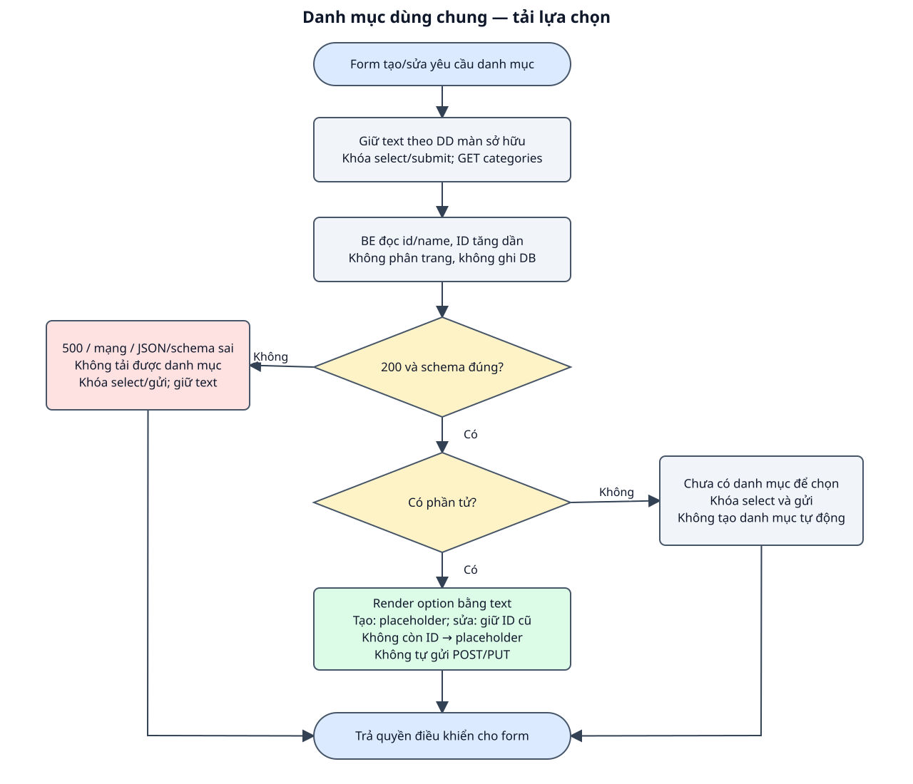

# DD — Tải danh mục dùng chung

## 1. Tổng quan

| Mục | Nội dung |
| --- | --- |
| Phạm vi | Tải toàn bộ id/name của categories theo ID tăng dần để dựng select; Phục vụ form tạo và cập nhật; không thêm tạo/sửa/xóa danh mục; Màn sở hữu chịu trách nhiệm giữ giá trị form và chọn ID hiện tại. |
| Route / nơi sử dụng | Dropdown trong form tạo/cập nhật; không có màn quản lý danh mục độc lập. |
| Quyền | Công khai theo API hiện có; không thiết kế auth/phân quyền. |
| Căn cứ / trạng thái | BE bám source; FE mới là bản nháp chờ review. Không sửa code ứng dụng trong lượt này. |
| Đầu vào | [Raw spec](raw_spec_load_categories.md), [BD](bd_load_categories.md), [hợp đồng chung](../../shared/api_conventions.md). |
| Bố cục | Select Danh mục và vùng trạng thái bên dưới trên form sở hữu; không thêm page riêng. |

FE là giao diện trình duyệt; BE là phía máy chủ. Item là thành phần giao diện, Event là thao tác/sự kiện, DS là nguồn dữ liệu, VAL là điều kiện kiểm tra và BR là quy tắc nghiệp vụ. Các mã dùng để đối chiếu testcase, không phải mã lỗi API. Loading là đang tải; schema là cấu trúc và kiểu dữ liệu của response.

## 2. Thành phần giao diện

| Thành phần / Item ID | Loại / mặc định | Hiển thị và tương tác | Nguồn / Event |
| --- | --- | --- | --- |
| SEL_CATEGORY | Select / placeholder | Name làm nhãn, id làm value; enabled khi ready và form không busy. | DS_CATEGORIES / EVENT_CATEGORIES_LOAD |
| TXT_CATEGORY_STATUS | Thông báo dưới select | Loading/rỗng/lỗi; ready có dữ liệu thì ẩn. | DS_CATEGORY_STATE |
| BTN_OWNER_SUBMIT | Nút của form sở hữu | Điều kiện gửi do DD create/update quản lý; không tạo nút mới. | Màn sở hữu |

Nhãn và focus có thể đọc/thao tác bằng bàn phím; thông báo không chỉ thể hiện bằng màu. Dữ liệu API được render như text. Phần UI mới là đề xuất, chưa có hình design để nghiệm thu màu/kích thước.

## 3. Validation

| Field / Validation ID | FE / thời điểm | BE / điều kiện | Thông báo / xử lý |
| --- | --- | --- | --- |
| VAL_CATEGORY_LIST | Sau GET: status200, data array; từng id integer/name string trước render. | Không có request field để validate; Controller get(id,name). | Response không đúng: Không tải được danh mục. |
| VAL_SELECTED_ID | Form sở hữu: ID phải thuộc danh sách đã tải khi submit. | Store/Update Request kiểm tra exists và DB FK khi ghi sản phẩm. | ID không hợp lệ xử lý ở DD create/update, không đổi hợp đồng GET. |

## 4. Nguồn dữ liệu

### 4.1. Nguồn và lưu trữ

| Data Source ID | Dữ liệu / nguồn | Đích sử dụng |
| --- | --- | --- |
| DS_CATEGORIES | GET categories.data[] id/name | Select của create/update. |
| DS_CATEGORY_STATE | loading/ready/empty/error | Vùng trạng thái; chưa quyết định việc reset field khác. |

Schema: [categories/products](../../shared/data_model.md). Giữ trách nhiệm đọc/ghi theo event, không tự thêm bảng hoặc field.

### 4.2. Input/Output

| Thao tác | Input / kiểu / bắt buộc / headers | Output / status / sử dụng FE |
| --- | --- | --- |
| GET danh mục | Accept JSON; không path/query/body; không cần Content-Type. | 200 {data: Category[]}; 500 lỗi chung; không ghi DB. |

Schema chi tiết ở các API trong mục 6; [ProductResource và lỗi chung](../../shared/api_conventions.md).

## 5. Xử lý chi tiết sự kiện giao diện

### EVENT_CATEGORIES_LOAD — tải và dựng lựa chọn

**Kích hoạt / điều kiện:** Mở form hoặc form yêu cầu reload sau lỗi category_id.

1. FE giữ dữ liệu khác theo DD màn sở hữu, khóa select/nút gửi và hiện Đang tải danh mục…; gửi GET /api/categories.
2. BE đọc categories.id/name, orderBy(id) asc, trả 200 data array; không ghi products/categories.
3. FE kiểm tra status/schema; data có phần tử thì render text theo thứ tự. Tạo dùng placeholder; cập nhật khôi phục category.id nếu còn trong danh sách, nếu không dùng placeholder.
4. Data []: empty, hiện Chưa có danh mục để chọn; select/nút gửi khóa. 500/mạng/JSON/schema sai: error, hiện Không tải được danh mục, giữ dữ liệu form và khóa gửi.
5. Không tự tạo danh mục, tự chọn ID thay thế hoặc gửi lại POST/PUT sau reload.

### Workflow

Hình và các event cùng mô tả nhánh success, dữ liệu/validation và lỗi; DB/read-write được ghi trong từng bước.

### Exception Case

| Điều kiện | HTTP / response | FE xử lý | Ảnh hưởng DB |
| --- | --- | --- | --- |
| DB đọc lỗi | 500 | Không tải được danh mục; khóa select/nút gửi. | Không ghi DB. |
| Mạng/timeout/JSON/schema sai | Không có xác nhận hoặc sai response | Trạng thái error, không coi là empty. | GET không ghi DB. |

## 6. Tài liệu API

| API ID | Method / endpoint | Đặc tả |
| --- | --- | --- |
| API_LOAD_CATEGORIES | GET /api/categories | [GET danh mục](api_specs/api_load_categories.md) |

## 7. Business Rules

| Rule ID | Quy tắc | Căn cứ / Event |
| --- | --- | --- |
| BR_CATEGORY_ORDER | ID tăng dần; chỉ trả id/name, không phân trang. | CategoryController@index |
| BR_CATEGORY_READONLY | GET không thay dữ liệu; danh mục tồn tại lúc tải chưa bảo đảm tồn tại lúc gửi sản phẩm. | Controller + FK / DD màn sở hữu |
| BR_CATEGORY_OWNER | Không thêm màn CRUD; selection/reset thuộc DD create/update. | Phạm vi / EVENT_CATEGORIES_LOAD |

**Điểm cần review:** BE/API đã có; UI được dùng theo DD create đã duyệt và DD update nháp; Không tạo route /categories hoặc màn CRUD danh mục. [Testcase đối chiếu](testcase_load_categories.md).

**Chức năng liên quan:** [Form tạo](../../products/create/dd_create_product.md), [form cập nhật](../../products/update/dd_update_product.md).
