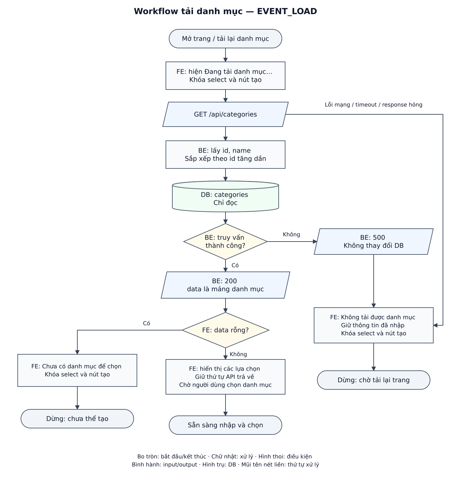
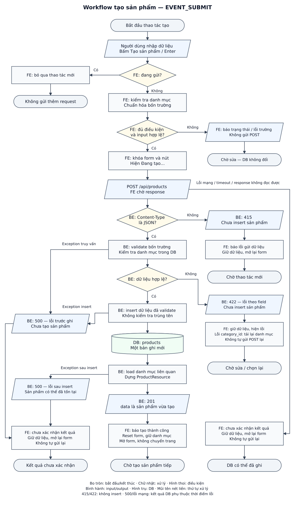

# DD — Tạo sản phẩm mới

## 1. Tổng quan

| Mục | Nội dung |
| --- | --- |
| Mã màn hình | `CREATE_PRODUCT` — định danh dùng trong bộ tài liệu này. |
| Mục đích | Người dùng nhập thông tin, chọn danh mục và tạo một sản phẩm mới. |
| Phạm vi | Một form FE (giao diện trình duyệt), API tạo sản phẩm và API danh mục hỗ trợ. BE (phía máy chủ) giữ hành vi code hiện có. |
| Đầu vào thiết kế | [Raw spec có User Story](raw_spec_create_product.md) và [BD](bd_create_product.md), được người học review đồng ý ngày 06/10/2026. |
| Route / đơn vị tiền | Màn hình `GET /products/create`, nhãn **Giá (VNĐ)**, đã được người học chốt ngày 06/10/2026. Route FE đã có trong `routes/web.php`; API không có trường đơn vị tiền. |
| Truy cập | Người dùng của mini project; API công khai, không có đăng nhập hoặc phân quyền trong chức năng này. |
| Căn cứ / trạng thái | AI soạn ngày 06/10/2026 theo Laravel 13.34.0 và source hiện có. Người học đã chấp nhận phần thiết kế; theo góp ý tiếp theo, bổ sung mục Input/Output và Exception Case để dễ tra cứu. Đã có source FE tạo sản phẩm; chưa có bằng chứng nghiệm thu browser trong lượt lập bộ tài liệu này. |
| Thiết kế màn hình | Một cột: tiêu đề → Tên sản phẩm → Giá → Danh mục → Mô tả → nút tạo và vùng kết quả. Dùng bố cục chữ đã duyệt trong BD; chưa có wireframe để đối chiếu màu/kích thước. |

Các mã Item, Event, Validation, DS và Rule dưới đây dùng để tham chiếu giữa thiết kế và testcase; không phải mã lỗi trả về từ API. Chức năng không bao gồm ảnh sản phẩm, CRUD danh mục hoặc màn xem/sửa/xóa sản phẩm.

## 2. Thành phần giao diện

| Thành phần / Item ID | Loại | Bắt buộc | Giới hạn / mặc định | Hiển thị và tương tác | Nguồn dữ liệu | Sự kiện |
| --- | --- | --- | --- | --- | --- | --- |
| Tạo sản phẩm mới — `TXT_TITLE` | Tiêu đề | — | Nội dung cố định | Luôn hiển thị. | Nội dung tĩnh | — |
| Tên sản phẩm — `INP_NAME` | Input text | Có | Chuỗi; ban đầu rỗng; xem §3 | Nhãn nằm trên ô; lỗi nằm dưới ô. | `DS_FORM.name` | `EVENT_EDIT` |
| Giá (VNĐ) — `INP_PRICE` | Input text, `inputmode="decimal"` | Có | Chuỗi số thập phân; ban đầu rỗng; xem §3 | Giữ chuỗi đang nhập để kiểm tra số lẻ; hướng dẫn dùng dấu `.` cho phần thập phân, không có dấu phân cách hàng nghìn. | `DS_FORM.price` | `EVENT_EDIT` |
| Danh mục — `SEL_CATEGORY` | Select | Có | Giá trị đầu là rỗng, nhãn **Chọn danh mục** | Mỗi lựa chọn hiển thị `name`, giữ `id`; khóa khi đang tải, danh sách rỗng hoặc tải lỗi. | `DS_CATEGORIES` → `DS_FORM.categoryId` | `EVENT_EDIT` |
| Mô tả — `INP_DESCRIPTION` | Textarea | Không | Chuỗi; ban đầu rỗng; xem §3 | Cho phép nhiều dòng; lỗi nằm dưới ô. | `DS_FORM.description` | `EVENT_EDIT` |
| Tạo sản phẩm — `BTN_CREATE` | Button submit | — | Nhãn **Tạo sản phẩm** | Khóa khi chưa chọn danh mục hợp lệ hoặc đang gửi. Khi gửi đổi nhãn thành **Đang tạo…**. | `DS_FORM_STATE` | `EVENT_SUBMIT` |
| Trạng thái danh mục — `TXT_CATEGORY_STATUS` | Vùng thông báo dưới select | — | Ban đầu **Đang tải danh mục…** | Hiện loading/rỗng/lỗi theo §5.1; ẩn khi tải được danh sách có phần tử. | `DS_FORM_STATE.categoryStatus` | `EVENT_LOAD` |
| Kết quả — `TXT_RESULT` | Vùng thông báo gần nút | — | Ban đầu không có nội dung | Hiện thông báo thành công hoặc lỗi chung; lỗi từng trường có vùng riêng dưới trường đó. | `DS_FORM_STATE` | `EVENT_SUBMIT` |

Trong lúc gửi, khóa cả bốn trường để giá trị trên màn hình khớp yêu cầu đang xử lý; mở lại khi nhận kết quả hoặc gặp lỗi kết nối. Form hỗ trợ Enter; Enter trong Mô tả vẫn xuống dòng. Dùng label gắn với input, báo lỗi bằng chữ và liên kết lỗi với trường qua `aria-describedby`/`aria-invalid`. Hiển thị tên danh mục và thông báo API bằng text an toàn.

## 3. Validation

**Chuẩn hóa trước khi kiểm tra:** FE bỏ khoảng trắng đầu/cuối của tên, giá và mô tả; giữ khoảng trắng/nội dung xuống dòng bên trong. Cách này bám middleware `TrimStrings` hiện có ở BE. Mô tả trống gửi `null`; lựa chọn danh mục hợp lệ chuyển thành số nguyên. Không ép `null` thành chuỗi. Đếm độ dài chuỗi theo ký tự Unicode, không đếm byte.

FE kiểm tra khi submit, hiển thị các lỗi cùng lúc và focus trường lỗi đầu tiên theo thứ tự trên màn hình. Chưa hiện lỗi khi vừa mở trang. BE luôn kiểm tra lại bằng [StoreProductRequest](../../../app/Http/Requests/StoreProductRequest.php), kể cả khi FE đã kiểm tra thành công.

| Validation ID / Field | Điều kiện chấp nhận | Kiểm tra FE | Kiểm tra BE | Thông báo dưới trường |
| --- | --- | --- | --- | --- |
| `VAL_NAME` — `name` | Chuỗi không rỗng sau chuẩn hóa, tối đa 255 ký tự. | Khi submit | `required`, `string`, `max:255` | Rỗng: **Vui lòng nhập tên sản phẩm**. Quá dài: **Tên sản phẩm tối đa 255 ký tự**. |
| `VAL_PRICE` — `price` | Có giá trị; số từ `0` đến `99999999.99`, tối đa 2 chữ số thập phân. | Khi submit; không làm tròn giá trị sai để cho qua. | `required`, `numeric`, `min:0`, `max:99999999.99`, `decimal:0,2` | Rỗng: **Vui lòng nhập giá**. Sai định dạng/giới hạn: **Giá phải từ 0 đến 99999999.99 và có tối đa 2 chữ số thập phân**. |
| `VAL_CATEGORY` — `category_id` | Chọn một `id` trong danh sách đã tải; danh mục vẫn tồn tại khi BE kiểm tra. | Khi submit; FE chỉ biết danh sách đã tải. | `required`, `integer`, `exists:categories,id` | Chưa chọn: **Vui lòng chọn danh mục**. BE báo không hợp lệ: **Danh mục không còn hợp lệ, vui lòng chọn lại**. |
| `VAL_DESCRIPTION` — `description` | Trống được chấp nhận; có nội dung thì là chuỗi tối đa 2000 ký tự sau chuẩn hóa. | Khi submit | `nullable`, `string`, `max:2000` | **Mô tả tối đa 2000 ký tự**. |

Định dạng giá FE chấp nhận là chuỗi khớp `^[+-]?(?:\d+(?:\.\d{0,2})?|\.\d{1,2})$`, đồng thời giá trị số nằm trong khoảng trên. Ví dụ `0`, `12.5`, `.5`, `12.50` hợp lệ; dấu phẩy, ký hiệu tiền hoặc chuỗi `1e2` không dùng trong form này. FE gửi `price` dạng chuỗi số để giữ nguyên phần thập phân; API hiện cũng chấp nhận số JSON theo đặc tả.

Với response `422`, map key `errors.name`, `errors.price`, `errors.category_id`, `errors.description` về đúng trường. Dùng thông báo FE tương ứng nếu xác định được điều kiện sai; trường hợp khác hiển thị message đầu tiên của mảng lỗi API. Key không nhận biết hoặc response thiếu lỗi theo trường chuyển thành thông báo chung **Thông tin chưa hợp lệ, vui lòng kiểm tra lại**. Không suy luận loại lỗi bằng cách phân tích câu message tiếng Anh của BE.

## 4. Nguồn dữ liệu

### 4.1. Nguồn và lưu trữ

| Data Source ID | Dữ liệu / kiểu | Nguồn | Đích sử dụng |
| --- | --- | --- | --- |
| `DS_CATEGORIES` | Mảng `{id: integer, name: string}` | `API_LOAD_CATEGORIES.data[]` | Lựa chọn của `SEL_CATEGORY`, giữ thứ tự API trả về. |
| `DS_FORM` | `name`, `price`, `categoryId`, `description`; giá trị nhập là chuỗi | Các trường trên form | Payload `API_CREATE_PRODUCT`: `name`, `price`, `category_id`, `description`. Không gửi các trạng thái UI. |
| `DS_CREATED_PRODUCT` | Sản phẩm trong `API_CREATE_PRODUCT.data` | Response tạo thành công | Xác nhận thao tác đã thành công; không dựng thêm màn chi tiết hoặc danh sách. |
| `DS_FORM_STATE` | `categoryStatus`: loading/ready/empty/error; `isSubmitting`: boolean; `fieldErrors`; `resultMessage` | Bộ nhớ của màn hình | Khóa/mở control và hiển thị trạng thái; không lưu form vào localStorage. |

**DB liên quan:** đọc `categories.id/name` để dựng select và kiểm tra danh mục; tạo một bản ghi `products` với `category_id/name/price/description` cùng ID/timestamps tự sinh. Sau insert, BE đọc lại danh mục liên quan cho response. Không ghi vào `categories`.

Schema dùng [migration categories](../../../database/migrations/2026_10_02_012235_create_categories_table.php) và [migration products](../../../database/migrations/2026_10_02_012242_create_products_table.php). `products.price` là `decimal(10,2)`, `description` nullable; khóa ngoại liên kết `category_id` với `categories.id` và hạn chế xóa danh mục đã có sản phẩm.

### 4.2. Input/Output

**Input — dữ liệu từ form gửi lên API tạo sản phẩm:**

| Trường giao diện → field JSON | Kiểu gửi từ FE | Bắt buộc | Giá trị sau chuẩn hóa |
| --- | --- | --- | --- |
| Tên sản phẩm → `name` | string | Có | Bỏ khoảng trắng đầu/cuối; không rỗng, tối đa 255 ký tự. |
| Giá (VNĐ) → `price` | string số thập phân | Có | Ví dụ `"150000.00"`; từ `0` đến `99999999.99`, tối đa 2 chữ số thập phân. Không gửi ký hiệu tiền. BE cũng nhận number JSON. |
| Danh mục → `category_id` | integer | Có | Gửi ID danh mục đang chọn, không gửi tên hoặc toàn bộ object danh mục. |
| Mô tả → `description` | string hoặc null | Không | Bỏ khoảng trắng đầu/cuối; trống gửi `null`, có nội dung tối đa 2000 ký tự. API cũng chấp nhận bỏ field. |

`POST /api/products` nhận body là object JSON, FE gửi `Content-Type: application/json` và `Accept: application/json`; không dùng path/query parameter. Chỉ gửi bốn field trên, không gửi trạng thái UI. Điều kiện kiểm tra và thời điểm validate ở §3.

`GET /api/categories` không có body hoặc tham số cho chức năng này; FE gửi `Accept: application/json`, không cần Content-Type.

**Output — response JSON và kết quả trên giao diện:**

| Thao tác / status | Dữ liệu trả về | FE sử dụng |
| --- | --- | --- |
| Tải danh mục — `200` | `{ "data": [...] }`; mỗi phần tử có `id: integer`, `name: string`, theo ID tăng dần. Có thể trả `data: []`. | Dựng lựa chọn; dùng `name` làm nhãn, giữ `id` để gửi. Danh sách rỗng hiển thị trạng thái empty theo §5.1. |
| Tạo sản phẩm — `201` | `{ "data": { ... } }`; các field sản phẩm được tóm tắt bên dưới. | Khi response đúng cấu trúc, báo thành công và reset form theo §5.3 bước 7. |
| Lỗi — `415`, `422`, `500` | `{ "message": string, "errors": object }`. Với `422`, `errors` chứa `{field: [message, ...]}`; với `415`/`500`, `errors` là `{}`. | Hiển thị lỗi theo trường hoặc thông báo chung; cách xử lý và ảnh hưởng DB ở §5.5. |

Object `data` của response `201` gồm:

- `id: integer`, `name: string`: ID mới và tên đã chuẩn hóa.
- `price: string`: luôn có hai chữ số thập phân, ví dụ `"150000.00"`.
- `description: string | null`: key vẫn có khi mô tả trống.
- `category: object` gồm `id: integer`, `name: string`; không có `category_id` ở cấp sản phẩm.
- `created_at`, `updated_at`: chuỗi thời gian ISO 8601 UTC khi tạo bình thường; Resource cho phép `null` nếu timestamp null.

Response thành công không có field `success`/`message`. Schema và JSON ví dụ đầy đủ nằm trong [API tạo sản phẩm](api_specs/api_create_product.md) và [API tải danh mục](../../categories/list/api_specs/api_load_categories.md); các bảng trên tóm tắt mapping cần dùng cho màn hình.

## 5. Xử lý chi tiết sự kiện giao diện

### 5.1. Tải danh mục — `EVENT_LOAD`

**Kích hoạt:** mở/tải lại trang, hoặc tải lại danh mục sau lỗi `422` của `category_id`. Lần mở trang đầu tiên khởi tạo form rỗng; lần tải lại danh mục sau lỗi giữ tên, giá và mô tả.

1. FE đặt `categoryStatus=loading`, khóa select và nút tạo; hiện **Đang tải danh mục…**.
2. FE gọi `GET /api/categories`. BE truy vấn `categories`, lấy `id/name` và sắp xếp theo `id` tăng dần; không ghi DB.
3. Nếu truy vấn thành công, BE trả `200` với `data` là mảng:
   - Có phần tử: FE lưu danh sách, đặt trạng thái ready, hiển thị lựa chọn với **Chọn danh mục** ban đầu. Nút tạo chỉ mở khi người dùng chọn được danh mục hợp lệ.
   - Mảng rỗng: FE đặt trạng thái empty, hiện **Chưa có danh mục để chọn**; select và nút tạo tiếp tục khóa. Đây là kết quả thành công, không phải lỗi API.
4. Nếu BE gặp exception, API trả `500`; nếu FE mất kết nối, không có response HTTP xác nhận. Response không đọc được hoặc `data` không phải mảng cũng được coi là lỗi tải. FE đặt trạng thái error, hiện **Không tải được danh mục**, giữ dữ liệu đã nhập và khóa select/nút tạo. Người dùng có thể tải lại trang bằng trình duyệt; không thêm nút retry riêng vào thiết kế này.

### 5.2. Thay đổi dữ liệu — `EVENT_EDIT`

**Kích hoạt:** người dùng nhập vào một trường hoặc đổi lựa chọn danh mục khi form không đang gửi.

FE cập nhật trường tương ứng trong `DS_FORM`. Nếu trường đang có lỗi thì xóa lỗi cũ của trường đó, chưa kiểm tra lại toàn form cho đến lần submit tiếp theo. Khi chọn danh mục, FE cập nhật điều kiện mở nút tạo. Thông báo kết quả cũ được xóa khi người dùng bắt đầu sửa dữ liệu cho thao tác mới.

### 5.3. Tạo sản phẩm — `EVENT_SUBMIT`

**Kích hoạt:** bấm **Tạo sản phẩm** hoặc Enter trong input. Cùng một hàm xử lý submit, không gắn hai đường gửi độc lập.

1. FE kiểm tra trạng thái. Nếu `isSubmitting=true`, bỏ qua thao tác mới. Nếu danh mục chưa ready, giữ nút khóa và trạng thái danh mục; không gửi POST. Việc đã chọn đúng danh mục được kiểm tra cùng dữ liệu ở bước 2.
2. FE lấy dữ liệu và chuẩn hóa theo §3, xóa lỗi/kết quả của lần submit trước rồi kiểm tra bốn trường. Có lỗi thì hiển thị lỗi, focus trường đầu tiên và dừng; DB chưa bị thay đổi.
3. Nếu hợp lệ, FE tạo snapshot dữ liệu gửi đi, đặt `isSubmitting=true`, khóa form/nút, đổi nhãn **Đang tạo…**, gửi `POST /api/products` với JSON và headers theo `API_CREATE_PRODUCT`.
4. BE chuẩn hóa request bằng middleware hiện có rồi kiểm tra kiểu nội dung gửi lên. Sai Content-Type thì trả `415`; controller chưa được gọi và không tạo sản phẩm. FE giữ dữ liệu, mở lại form, hiện **Không gửi được dữ liệu tạo sản phẩm**; không tự gửi lại.
5. BE kiểm tra bốn trường trong Form Request, bao gồm truy vấn danh mục có tồn tại:
   - Không hợp lệ: trả `422` với lỗi theo field; không insert sản phẩm. FE giữ dữ liệu, mở lại form, hiển thị/focus lỗi theo §3.
   - Có lỗi `category_id`: FE bỏ lựa chọn danh mục cũ, giữ ba trường còn lại và gọi `EVENT_LOAD` để lấy danh sách hiện tại. Không tự tạo lại sản phẩm sau khi tải xong.
6. Nếu hợp lệ, BE dùng bốn field đã validate để insert `products`; DB sinh ID và timestamps. BE tải danh mục liên quan, dựng `ProductResource` và trả `201` với `data` là sản phẩm mới.
7. Với `201` đúng cấu trúc: FE hiện **Tạo sản phẩm thành công**, xóa tên/giá/mô tả, đưa danh mục về **Chọn danh mục**, xóa lỗi và mở lại form. Giữ danh sách danh mục đã tải, không chuyển trang; nút tạo khóa đến khi chọn danh mục cho lần mới.
8. Nếu truy vấn/insert hoặc bước dựng response gặp exception, API trả `500`. Nếu mất kết nối, timeout hoặc response không đọc được/không đúng cấu trúc, FE chưa xác nhận được kết quả. FE mở lại form, giữ dữ liệu, hiện **Chưa xác nhận được kết quả tạo sản phẩm** và không tự gửi lại. Lỗi trước khi insert thành công không tạo bản ghi; lỗi sau insert hoặc mất kết nối có thể vẫn để lại sản phẩm. Người dùng tự bấm gửi lại là một yêu cầu mới và có thể tạo thêm bản ghi.

Mọi nhánh kết thúc lần gửi phải đưa `isSubmitting=false` và khôi phục nhãn nút. Điều kiện mở nút tiếp tục phụ thuộc trạng thái/lựa chọn danh mục. Message/lựa chọn từ API được render như văn bản, không ghép vào HTML.

### 5.4. Workflow

Hình tải danh mục tương ứng `EVENT_LOAD`; hình tạo sản phẩm tương ứng `EVENT_SUBMIT` và bốn validation ở §3. Hình dùng nhãn FE/BE/DB, thể hiện `200`, `201`, `415`, `422`, lỗi trước/sau insert và lỗi mạng. `EVENT_EDIT` chỉ cập nhật UI nên được mô tả bằng chữ ở §5.2. Quy ước: bo tròn là bắt đầu/kết thúc, chữ nhật là xử lý, hình thoi là điều kiện, bình hành là input/output, hình trụ là dữ liệu DB; mũi tên nét liền chỉ thứ tự xử lý.

### 5.5. Exception Case — các trường hợp lỗi và cách xử lý

Mục này tóm tắt nhánh lỗi để dev và người viết test dễ tra cứu; thứ tự xử lý vẫn theo các event ở §5.1–§5.3. Lỗi validation và lỗi hệ thống được phân biệt theo kết quả sau:

| Trường hợp | HTTP / response | Cách FE xử lý | Ảnh hưởng DB |
| --- | --- | --- | --- |
| Dữ liệu form không hợp lệ khi submit | Chưa gửi POST, không có status HTTP. | Hiện các lỗi dưới trường, focus trường đầu tiên; giữ dữ liệu để sửa (§3, §5.3 bước 2). | Không ghi DB. |
| Tải danh mục gặp lỗi truy vấn | GET trả `500`, `message`/`errors` theo §4.2. | Hiện **Không tải được danh mục**, khóa select/nút tạo, giữ dữ liệu đang nhập (§5.1). | Chỉ đọc, không ghi DB. |
| Tải danh mục mất kết nối/timeout, JSON không đọc được hoặc `data` không phải mảng | Không có response HTTP xác nhận khi lỗi mạng; response sai cấu trúc giữ status thực tế. | Xử lý như lỗi tải danh mục; không coi đây là danh sách rỗng (§5.1). | GET không ghi DB. |
| Request tạo sản phẩm sai hoặc thiếu Content-Type JSON | POST trả `415`. | Giữ dữ liệu, mở lại form, hiện **Không gửi được dữ liệu tạo sản phẩm**; không tự gửi lại (§5.3 bước 4). | Chưa vào controller, không insert. |
| BE từ chối dữ liệu, gồm danh mục không tồn tại | POST trả `422`, lỗi theo field. | Map lỗi về trường, giữ dữ liệu và focus lỗi. Nếu lỗi `category_id`, bỏ lựa chọn cũ và tải lại danh mục; giữ tên/giá/mô tả, không tự gửi lại POST (§3, §5.3 bước 5). | Không insert sản phẩm. |
| Response `422` có key lỗi không nhận biết hoặc thiếu lỗi theo trường | `422`, nhưng FE không map được lỗi về trường. | Hiện **Thông tin chưa hợp lệ, vui lòng kiểm tra lại**, giữ dữ liệu và mở lại form (§3). | Response validation từ BE hiện có không insert. |
| Exception khi kiểm tra danh mục hoặc insert chưa thành công | POST trả `500`. | Giữ dữ liệu, mở lại form, hiện **Chưa xác nhận được kết quả tạo sản phẩm**; không tự gửi lại (§5.3 bước 8). | Chưa tạo sản phẩm. Danh mục mất giữa validation và insert cũng có thể gây lỗi khóa ngoại `500`. |
| Exception sau insert, khi tải quan hệ hoặc dựng response | POST trả `500`. | Hiển thị và giữ dữ liệu như lỗi `500` ở trên; không báo thành công (§5.3 bước 8). | Sản phẩm có thể đã lưu; code chưa có transaction bao trùm cả luồng. |
| Request tạo sản phẩm mất kết nối/timeout | Không có response HTTP xác nhận. | Giữ dữ liệu, mở lại form, hiện **Chưa xác nhận được kết quả tạo sản phẩm**; không tự gửi lại (§5.3 bước 8). | Chưa xác định: request có thể đã được BE xử lý và lưu. |
| Response tạo sản phẩm không đọc được hoặc không đúng hợp đồng, kể cả `201` thiếu/sai field | Giữ status thực tế; FE không xác nhận thành công. | Giữ dữ liệu, mở lại form, hiện **Chưa xác nhận được kết quả tạo sản phẩm**; không reset hoặc tự gửi lại (§5.3 bước 7–8). | Chưa xác định từ response; có thể đã lưu. |

Sau khi lần gửi kết thúc, luôn trả `isSubmitting=false`, khôi phục nhãn nút; trạng thái mở nút còn phụ thuộc danh mục (§5.3). Không tự retry POST vì một lần gửi mới có thể tạo sản phẩm trùng. `200` với danh mục rỗng là kết quả hợp lệ, không phải exception. Chức năng hiện không có nhánh đăng nhập/phân quyền; danh mục không tồn tại là lỗi validation `422` theo API này.

## 6. Tài liệu API

| API ID | Method | Endpoint | Data Source | Đặc tả |
| --- | --- | --- | --- | --- |
| `API_LOAD_CATEGORIES` | GET | `/api/categories` | `DS_CATEGORIES` | [API tải danh mục](../../categories/list/api_specs/api_load_categories.md) |
| `API_CREATE_PRODUCT` | POST | `/api/products` | `DS_FORM` → `DS_CREATED_PRODUCT` | [API tạo sản phẩm](api_specs/api_create_product.md) |

API specs giữ bảng request/response, JSON ví dụ và cấu trúc lỗi chuẩn. DD mô tả cách cùng các kết quả này tác động lên form.

## 7. Business Rules

| Rule ID | Quy tắc | Căn cứ | Event/Validation liên quan |
| --- | --- | --- | --- |
| `BR_SERVER_VALIDATE` | BE phải validate lại, chỉ lưu dữ liệu đã được Form Request chấp nhận; FE không thay thế kiểm tra phía máy chủ. | `StoreProductRequest`, `ProductController@store` | `EVENT_SUBMIT`, cả bốn validation |
| `BR_CATEGORY_EXISTS` | Sản phẩm phải thuộc danh mục đang tồn tại. Danh sách FE có thể đã cũ; BE kiểm tra `exists` rồi DB áp dụng khóa ngoại. | Form Request và migration products | `VAL_CATEGORY`, `EVENT_LOAD`, `EVENT_SUBMIT` |
| `BR_PRICE` | Giá bằng 0 được chấp nhận; không làm tròn giá nhập sai để hợp thức hóa request. Giá lưu theo `decimal(10,2)`, trả về chuỗi có hai chữ số thập phân. | Form Request, migration, cast của Product | `VAL_PRICE`, `EVENT_SUBMIT` |
| `BR_DUPLICATE_NAME` | Tên sản phẩm có thể trùng. Không tìm tên trùng để chặn tạo; gửi hai request hợp lệ có thể tạo hai sản phẩm. | Không có rule/index unique cho tên sản phẩm | `VAL_NAME`, `EVENT_SUBMIT` |
| `BR_OPTIONAL_DESCRIPTION` | Mô tả là tùy chọn; bỏ field, `null` hoặc chuỗi trống sau chuẩn hóa đều có thể lưu `NULL`. Nội dung có giá trị phải qua kiểm tra §3. | Form Request, middleware, migration | `VAL_DESCRIPTION`, `EVENT_SUBMIT` |
| `BR_SUBMIT_STATE` | Khóa form và bỏ qua lần submit lặp trong lúc chờ kết quả. Cơ chế này chỉ kiểm soát màn hình hiện tại; API không có cơ chế nhận diện request trùng. | Chi tiết FE cho hành vi đang gửi trong BD | `EVENT_SUBMIT` |
| `BR_SUCCESS_RESET` | Chỉ reset form khi nhận `201` đúng cấu trúc; giữ màn hình và danh sách danh mục. | BD đã duyệt | `EVENT_SUBMIT` |
| `BR_FAILURE_PRESERVE` | Giữ dữ liệu khi lỗi, không tự gửi lại. Code chưa có transaction bao trùm insert và dựng response; không khẳng định mọi `500` đều chưa tạo sản phẩm. | BD, `ProductController@store`, handler | `EVENT_SUBMIT` |

**Đã chốt:** dùng VNĐ và mở form tại `/products/create`. Đơn vị tiền là nhãn giao diện; payload/rule giá theo §3–§4.2. Bộ testcase FE/BE và cách kiểm thử nằm trong [testcase_create_product.md](testcase_create_product.md).

**API dùng chung:** [DD tải danh mục](../../categories/list/dd_load_categories.md) mô tả use case dùng chung; các trạng thái/reset của form tạo vẫn theo DD này.