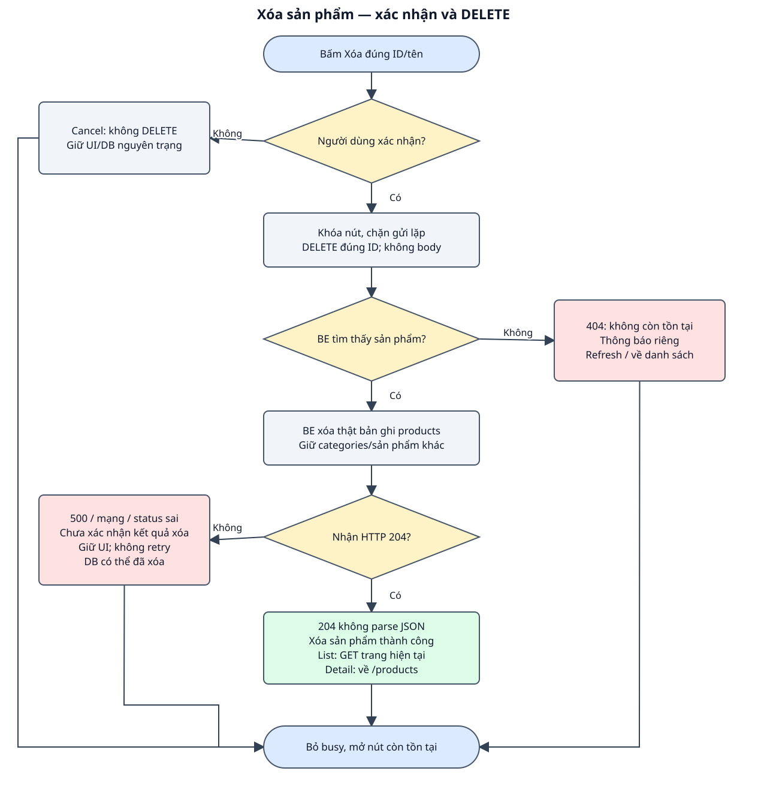

# DD — Xóa sản phẩm

## 1. Tổng quan

| Mục | Nội dung |
| --- | --- |
| Phạm vi | Xác nhận trước khi gửi DELETE; hủy thì không gửi request; Xóa bản ghi products theo ID; danh mục không bị xóa; Không có soft delete, thùng rác hoặc hoàn tác trong code hiện tại. |
| Route / nơi sử dụng | Nút Xóa trong danh sách/chi tiết; không có trang /delete riêng. Hai nơi gọi cùng use case. |
| Quyền | Công khai theo API hiện có; không thiết kế auth/phân quyền. |
| Căn cứ / trạng thái | BE bám source; FE mới là bản nháp chờ review. Không sửa code ứng dụng trong lượt này. |
| Đầu vào | [Raw spec](raw_spec_delete_product.md), [BD](bd_delete_product.md), [hợp đồng chung](../../shared/api_conventions.md). |
| Bố cục | Nút Xóa cạnh sản phẩm; hộp thoại trình duyệt hỏi Xóa sản phẩm “tên sản phẩm”?; kết quả hiện trên màn sở hữu. |

FE là giao diện trình duyệt; BE là phía máy chủ. Item là thành phần giao diện, Event là thao tác/sự kiện, DS là nguồn dữ liệu, VAL là điều kiện kiểm tra và BR là quy tắc nghiệp vụ. Các mã dùng để đối chiếu testcase, không phải mã lỗi API. Loading là đang tải; schema là cấu trúc và kiểu dữ liệu của response.

## 2. Thành phần giao diện

| Thành phần / Item ID | Loại / mặc định | Hiển thị và tương tác | Nguồn / Event |
| --- | --- | --- | --- |
| BTN_DELETE | Button tại hàng/chi tiết | Enabled khi có product ID và không đang xóa; busy: Đang xóa… | DS_TARGET / EVENT_DELETE |
| DIALOG_CONFIRM | Xác nhận native của trình duyệt | Nêu tên; Hủy không gửi; không tạo custom modal/focus trap riêng. | Snapshot product |
| TXT_RESULT | Vùng thông báo màn sở hữu | Kết quả chữ; hiển thị an toàn tên/message. | DS_STATE |

Nhãn và focus có thể đọc/thao tác bằng bàn phím; thông báo không chỉ thể hiện bằng màu. Dữ liệu API được render như text. Phần UI mới là đề xuất, chưa có hình design để nghiệm thu màu/kích thước.

## 3. Validation

| Field / Validation ID | FE / thời điểm | BE / điều kiện | Thông báo / xử lý |
| --- | --- | --- | --- |
| VAL_TARGET_ID | Trước confirm: ID nguyên dương từ sản phẩm đã tải; giữ snapshot không lấy ID từ vị trí hàng mới. | Route model binding: không tìm thấy →404. | Không có mục tiêu hợp lệ thì không gửi. |
| VAL_DELETE_RESPONSE | Chỉ 204 là thành công; không gọi response.json() ở nhánh 204. | destroy gọi delete rồi response()->noContent(). | Status khác/response lỗi → xử lý lỗi, không báo thành công giả. |

## 4. Nguồn dữ liệu

### 4.1. Nguồn và lưu trữ

| Data Source ID | Dữ liệu / nguồn | Đích sử dụng |
| --- | --- | --- |
| DS_TARGET | Snapshot id/name + nguồn list/detail | ID path và câu hỏi xác nhận. |
| DS_STATE | isDeleting/result + page của màn danh sách | Chặn gửi lặp; chọn refresh hoặc điều hướng. |

Schema: [categories/products](../../shared/data_model.md). Giữ trách nhiệm đọc/ghi theo event, không tự thêm bảng hoặc field.

### 4.2. Input/Output

| Thao tác | Input / kiểu / bắt buộc / headers | Output / status / sử dụng FE |
| --- | --- | --- |
| DELETE | id path bắt buộc; Accept JSON; không body, không cần Content-Type. | 204 không body; 404/500 lỗi chung. Xóa products, giữ categories. |

Schema chi tiết ở các API trong mục 6; [ProductResource và lỗi chung](../../shared/api_conventions.md).

## 5. Xử lý chi tiết sự kiện giao diện

### EVENT_DELETE — xác nhận và xóa

**Kích hoạt / điều kiện:** Bấm Xóa khi product đã tải, không busy.

1. FE lấy snapshot id/name và mở xác nhận trình duyệt. Hủy: kết thúc, DELETE=0, dữ liệu giữ nguyên.
2. Xác nhận: đặt busy/khóa action mục tiêu, gửi DELETE /api/products/{id}; không xóa hàng trước response.
3. BE bind product; không tồn tại trả 404. Tìm thấy: model delete() xóa products theo ID rồi trả 204 không body; không xóa categories.
4. FE nhận 204: báo Xóa sản phẩm thành công. Từ list gọi tải lại page hiện tại, xử lý page cuối rỗng theo DD danh sách; từ detail điều hướng /products.
5. 404: báo Sản phẩm không còn tồn tại, refresh list hoặc về list từ detail; không nhận đây là một response 204.
6. 500/mạng/status không đúng: báo Chưa xác nhận được kết quả xóa sản phẩm, giữ hiển thị cũ và mở action; không tự DELETE lại. Nếu DELETE đã commit trước lỗi mạng thì bản ghi có thể đã mất.
7. Kết thúc mọi nhánh bỏ busy/khôi phục nhãn nếu control còn trong DOM; focus về vị trí hợp lý sau refresh.

### Workflow

Hình và các event cùng mô tả nhánh success, dữ liệu/validation và lỗi; DB/read-write được ghi trong từng bước.

### Exception Case

| Điều kiện | HTTP / response | FE xử lý | Ảnh hưởng DB |
| --- | --- | --- | --- |
| ID đã bị xóa trước request | 404 | Thông báo không còn tồn tại; làm mới màn sở hữu. | Không xóa sản phẩm khác. |
| Exception trước DELETE thành công | 500 | Giữ UI, báo chưa xác nhận; mở lại action. | Nếu lỗi trước ghi, bản ghi còn. |
| Mất mạng/response lỗi sau gửi | Không có xác nhận hoặc status ngoài hợp đồng | Không tự bỏ hàng/retry; người dùng kiểm tra lại dữ liệu. | Có thể đã xóa; chưa xác định từ client. |

## 6. Tài liệu API

| API ID | Method / endpoint | Đặc tả |
| --- | --- | --- |
| API_DELETE_PRODUCT | DELETE /api/products/{product} | [DELETE sản phẩm](api_specs/api_delete_product.md) |

## 7. Business Rules

| Rule ID | Quy tắc | Căn cứ / Event |
| --- | --- | --- |
| BR_DELETE_CONFIRM | Chỉ gửi sau xác nhận; Hủy không có DELETE. | BD đề xuất / EVENT_DELETE |
| BR_DELETE_TARGET | Xóa đúng ID, không xóa danh mục hoặc sản phẩm khác. | Controller@destroy / schema |
| BR_DELETE_RESPONSE | 204 không body, không parse JSON; 404 là mục tiêu không còn. | Controller + handler |
| BR_DELETE_STATE | Chặn bấm lặp; không optimistic delete hoặc tự retry khi chưa xác nhận. | BD đề xuất / EVENT_DELETE |

**Điểm cần review:** Đề xuất xác nhận bằng hộp thoại trình duyệt và hành vi refresh/điều hướng; cần review; Lỗi mạng chưa xác định được thao tác xóa; không tự gửi lại. [Testcase đối chiếu](testcase_delete_product.md).

**Chức năng liên quan:** [Danh sách: refresh và fallback trang](../list/dd_list_products.md), [chi tiết: điều hướng sau xóa](../detail/dd_view_product.md).
