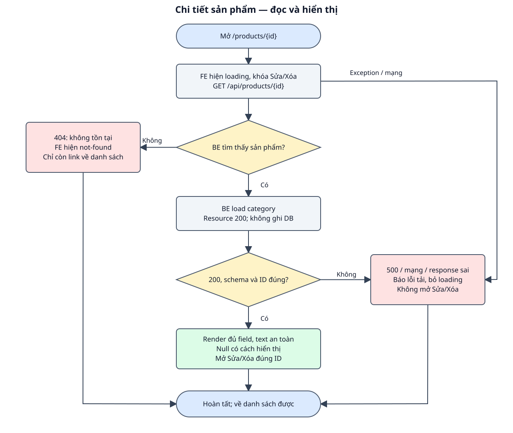

# DD — Chi tiết sản phẩm

## 1. Tổng quan

| Mục | Nội dung |
| --- | --- |
| Phạm vi | Xem ID, tên, giá, danh mục, mô tả và thời gian sản phẩm; Có link về danh sách, Sửa và nút Xóa theo DD tương ứng; Không thêm ảnh, lịch sử thay đổi hoặc phân quyền. |
| Route / nơi sử dụng | `/products/{id}` — route FE đề xuất, chưa có source; đặt route tĩnh /products/create trước route động hoặc ràng buộc ID số. |
| Quyền | Công khai theo API hiện có; không thiết kế auth/phân quyền. |
| Căn cứ / trạng thái | BE bám source; FE mới là bản nháp chờ review. Không sửa code ứng dụng trong lượt này. |
| Đầu vào | [Raw spec](raw_spec_view_product.md), [BD](bd_view_product.md), [hợp đồng chung](../../shared/api_conventions.md). |
| Bố cục | Tiêu đề Chi tiết sản phẩm; khối thông tin đọc, mô tả nhiều dòng; link về danh sách và thao tác sửa/xóa. |

FE là giao diện trình duyệt; BE là phía máy chủ. Item là thành phần giao diện, Event là thao tác/sự kiện, DS là nguồn dữ liệu, VAL là điều kiện kiểm tra và BR là quy tắc nghiệp vụ. Các mã dùng để đối chiếu testcase, không phải mã lỗi API. Loading là đang tải; schema là cấu trúc và kiểu dữ liệu của response.

## 2. Thành phần giao diện

| Thành phần / Item ID | Loại / mặc định | Hiển thị và tương tác | Nguồn / Event |
| --- | --- | --- | --- |
| TXT_PRODUCT | Khối đọc; ban đầu loading | Render toàn bộ field ProductResource; mô tả giữ dòng bằng CSS. | DS_PRODUCT / EVENT_DETAIL_LOAD |
| LNK_BACK | Link | Mở /products. | Route đề xuất |
| LNK_EDIT/BTN_DELETE | Link / button | Chỉ mở khi product đã xác nhận; dùng ID đã tải. | DS_PRODUCT / update/delete |
| TXT_STATUS | Thông báo | Loading, not-found hoặc error; không có form nhập. | DS_STATE |

Nhãn và focus có thể đọc/thao tác bằng bàn phím; thông báo không chỉ thể hiện bằng màu. Dữ liệu API được render như text. Phần UI mới là đề xuất, chưa có hình design để nghiệm thu màu/kích thước.

## 3. Validation

| Field / Validation ID | FE / thời điểm | BE / điều kiện | Thông báo / xử lý |
| --- | --- | --- | --- |
| VAL_ID | ID nguyên dương từ route; không gửi ID sai từ link. | Model binding truy vấn sản phẩm; không tồn tại →404; không có Form Request. | ID không hợp lệ hoặc không tồn tại: Sản phẩm không tồn tại. |
| VAL_PRODUCT_SCHEMA | 200 phải đủ field/kiểu ProductResource; ID khớp route. | Controller load(category) rồi Resource. | Sai JSON/schema/ID → Không tải được thông tin sản phẩm. |

## 4. Nguồn dữ liệu

### 4.1. Nguồn và lưu trữ

| Data Source ID | Dữ liệu / nguồn | Đích sử dụng |
| --- | --- | --- |
| DS_PRODUCT | API_GET_PRODUCT.data / ProductResource | Khối thông tin và ID các action. |
| DS_STATE | loading/ready/not-found/error | Thông báo và enabled thao tác. |

Schema: [categories/products](../../shared/data_model.md). Giữ trách nhiệm đọc/ghi theo event, không tự thêm bảng hoặc field.

### 4.2. Input/Output

| Thao tác | Input / kiểu / bắt buộc / headers | Output / status / sử dụng FE |
| --- | --- | --- |
| GET chi tiết | id trong path, bắt buộc; Accept JSON; không body. | 200: {data: Product}; 404/500: lỗi chung. FE hiển thị hoặc not-found/error. |

Schema chi tiết ở các API trong mục 6; [ProductResource và lỗi chung](../../shared/api_conventions.md).

## 5. Xử lý chi tiết sự kiện giao diện

### EVENT_DETAIL_LOAD — mở chi tiết

**Kích hoạt / điều kiện:** Mở route với ID sản phẩm.

1. FE khóa Sửa/Xóa, hiện Đang tải sản phẩm… và gửi GET /api/products/{id}.
2. BE route model binding đọc products; không tìm thấy trả 404. Có sản phẩm thì load categories.id/name, dựng ProductResource và trả 200; không ghi DB.
3. FE nhận 200 đúng schema/ID thì render text, giá hai số lẻ + VNĐ; mô tả null thành Chưa có mô tả, timestamps null thành —; mở action.
4. 404: hiện Sản phẩm không tồn tại, giữ action sửa/xóa khóa. 500/mạng/JSON sai: hiện Không tải được thông tin sản phẩm, khóa action và kết thúc loading.

### EVENT_DETAIL_ACTION — thao tác

**Kích hoạt / điều kiện:** Product đã tải thành công.

1. Sửa mở /products/{id}/edit; Xóa dùng đúng product ID và luồng DD xóa; quay lại mở /products.
2. Sau xóa 204 điều hướng danh sách; không thêm trang xác nhận riêng.

### Workflow

Hình và các event cùng mô tả nhánh success, dữ liệu/validation và lỗi; DB/read-write được ghi trong từng bước.

### Exception Case

| Điều kiện | HTTP / response | FE xử lý | Ảnh hưởng DB |
| --- | --- | --- | --- |
| Binding không thấy ID | 404, Resource not found. | Hiện not-found; chỉ còn link về danh sách. | Không ghi DB. |
| DB/Resource exception | 500, lỗi chung | Hiện lỗi tải; không mở Sửa/Xóa. | GET không ghi DB. |
| Mạng hoặc response sai | Không có response xác nhận hoặc JSON/schema sai | Hiện lỗi tải, kết thúc loading; không render sản phẩm sai. | GET không ghi DB. |

## 6. Tài liệu API

| API ID | Method / endpoint | Đặc tả |
| --- | --- | --- |
| API_GET_PRODUCT | GET /api/products/{product} | [GET chi tiết](api_specs/api_get_product.md) |

## 7. Business Rules

| Rule ID | Quy tắc | Căn cứ / Event |
| --- | --- | --- |
| BR_DETAIL_ID | Chỉ hiển thị đúng ID được yêu cầu; không lấy sản phẩm đầu tiên thay thế. | Route binding / EVENT_DETAIL_LOAD |
| BR_DETAIL_READONLY | GET chỉ đọc và trả quan hệ đã load. | ProductController@show |
| BR_DETAIL_EMPTY | Mô tả/timestamp null có cách trình bày; null không phải lỗi cả sản phẩm. | ProductResource / BD đề xuất |

**Điểm cần review:** Đề xuất route /products/{id} và các link về danh sách/sửa; cần review; Mô tả null hiện Chưa có mô tả; timestamp null hiện —. [Testcase đối chiếu](testcase_view_product.md).

**Chức năng liên quan:** [Danh sách](../list/dd_list_products.md), [cập nhật](../update/dd_update_product.md), [xóa](../delete/dd_delete_product.md).
