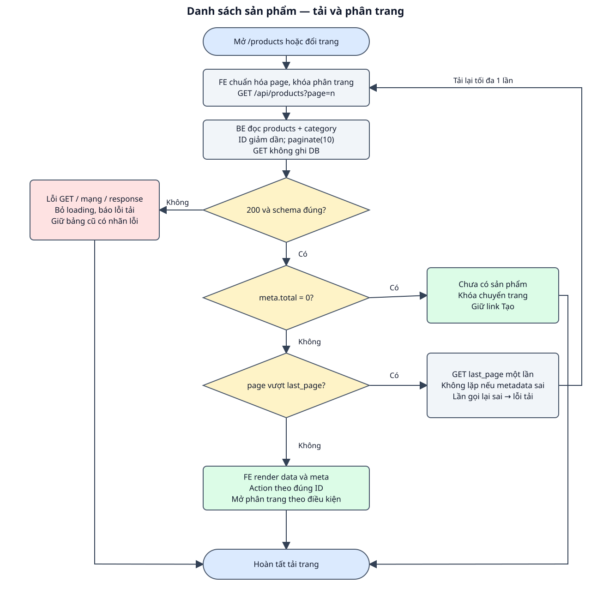

# DD — Danh sách sản phẩm

## 1. Tổng quan

| Mục | Nội dung |
| --- | --- |
| Phạm vi | Xem sản phẩm, danh mục và giá; phân trang 10 sản phẩm/trang, ID giảm dần; Liên kết sang tạo, chi tiết, cập nhật; nút Xóa dùng chức năng xóa riêng; Không thêm tìm kiếm, lọc, tùy chọn số dòng hoặc CRUD danh mục. |
| Route / nơi sử dụng | `/products` — route FE đề xuất, chưa có source; API GET /api/products đã có. |
| Quyền | Công khai theo API hiện có; không thiết kế auth/phân quyền. |
| Căn cứ / trạng thái | BE bám source; FE mới là bản nháp chờ review. Không sửa code ứng dụng trong lượt này. |
| Đầu vào | [Raw spec](raw_spec_list_products.md), [BD](bd_list_products.md), [hợp đồng chung](../../shared/api_conventions.md). |
| Bố cục | Tiêu đề Danh sách sản phẩm, link Tạo sản phẩm, bảng ID/Tên/Giá (VNĐ)/Danh mục/Thao tác và phân trang bên dưới. |

FE là giao diện trình duyệt; BE là phía máy chủ. Item là thành phần giao diện, Event là thao tác/sự kiện, DS là nguồn dữ liệu, VAL là điều kiện kiểm tra và BR là quy tắc nghiệp vụ. Các mã dùng để đối chiếu testcase, không phải mã lỗi API. Loading là đang tải; schema là cấu trúc và kiểu dữ liệu của response.

## 2. Thành phần giao diện

| Thành phần / Item ID | Loại / mặc định | Hiển thị và tương tác | Nguồn / Event |
| --- | --- | --- | --- |
| TXT_LIST / bảng | Bảng; ban đầu loading | Hiển thị ID/name/price/category; tên là link chi tiết. | DS_LIST / EVENT_LIST_LOAD |
| BTN_CREATE | Link | Mở /products/create đã chốt. | Nội dung tĩnh |
| BTN_PREV/NEXT | Button | Khóa khi loading hoặc không có trang. | DS_META / EVENT_PAGE_CHANGE |
| BTN_EDIT/DELETE | Link sửa / button xóa | Giữ ID đúng hàng; xóa theo DD riêng. | DS_LIST / chức năng update/delete |
| TXT_STATUS | Vùng trạng thái | Loading, empty hoặc lỗi; lỗi được thông báo bằng chữ. | DS_STATE |

Nhãn và focus có thể đọc/thao tác bằng bàn phím; thông báo không chỉ thể hiện bằng màu. Dữ liệu API được render như text. Phần UI mới là đề xuất, chưa có hình design để nghiệm thu màu/kích thước.

## 3. Validation

| Field / Validation ID | FE / thời điểm | BE / điều kiện | Thông báo / xử lý |
| --- | --- | --- | --- |
| VAL_PAGE / page | Trước GET: số nguyên >=1, chỉ chuyển tới trang cho phép từ meta; direct URL sai quy về 1. | Paginator FILTER_VALIDATE_INT và >=1; không trả 422 cho page sai. | Không gửi page sai từ control; không thêm lỗi query giả. |
| VAL_LIST_SCHEMA | Sau GET: data array và meta/current_page/last_page/per_page hợp lệ, từng sản phẩm đúng schema. | Resource collection + paginator. | Sai JSON/schema/status → lỗi tải; không dựng bảng từ response sai. |

## 4. Nguồn dữ liệu

### 4.1. Nguồn và lưu trữ

| Data Source ID | Dữ liệu / nguồn | Đích sử dụng |
| --- | --- | --- |
| DS_LIST | API_LIST_PRODUCTS.data[] / ProductResource | Bảng và action theo ID. |
| DS_META | meta.current_page/last_page/per_page/total; links là thông tin phân trang | Nút chuyển trang; không gán URL không kiểm tra từ API. |
| DS_STATE | page, loading, dữ liệu đã xác nhận, thông báo | Chặn request chuyển trang lặp và phản hồi UI. |

Schema: [categories/products](../../shared/data_model.md). Giữ trách nhiệm đọc/ghi theo event, không tự thêm bảng hoặc field.

### 4.2. Input/Output

| Thao tác | Input / kiểu / bắt buộc / headers | Output / status / sử dụng FE |
| --- | --- | --- |
| GET danh sách | page integer >=1, tùy chọn, mặc định 1; Accept JSON; không body. | 200: {data: Product[], links, meta}; 500: lỗi chung; FE hiển thị hoặc báo lỗi. |

Schema chi tiết ở các API trong mục 6; [ProductResource và lỗi chung](../../shared/api_conventions.md).

## 5. Xử lý chi tiết sự kiện giao diện

### EVENT_LIST_LOAD — tải trang

**Kích hoạt / điều kiện:** Mở /products hoặc tải lại sau thao tác xóa.

1. FE chuẩn hóa page, đặt loading, khóa phân trang và bỏ qua lần chuyển trang khi đang tải.
2. FE gửi GET /api/products?page=n. BE đọc products, eager load category:id,name, orderByDesc(id), paginate(10); không ghi DB.
3. BE trả 200 với data/links/meta. FE kiểm tra schema. Nếu meta.total=0, hiện Chưa có sản phẩm, khóa chuyển trang.
4. Nếu page vượt last_page mà total>0, FE gọi lại đúng last_page một lần; không báo toàn bộ hệ thống rỗng. Nếu vẫn sai schema/metadata thì báo lỗi.
5. Nếu có sản phẩm, render an toàn và cập nhật page/meta; mở các nút theo điều kiện. GET 500/mạng/JSON sai: giữ dữ liệu cũ có nhãn lỗi, mở lại phân trang dựa vào meta đã xác nhận; request đầu lỗi thì không hiện bảng giả.

### EVENT_PAGE_CHANGE — đổi trang

**Kích hoạt / điều kiện:** Bấm Trang trước/Trang sau khi không loading và có trang đích.

1. FE lấy trang đích từ số current_page +/-1, kiểm tra 1..last_page rồi gọi EVENT_LIST_LOAD.
2. Không dùng URL API làm link giao diện trực tiếp. Xóa thành công gọi lại trang hiện tại theo DD xóa.

### Workflow

Hình và các event cùng mô tả nhánh success, dữ liệu/validation và lỗi; DB/read-write được ghi trong từng bước.

### Exception Case

| Điều kiện | HTTP / response | FE xử lý | Ảnh hưởng DB |
| --- | --- | --- | --- |
| GET exception | 500, message/errors chung | Không tải được danh sách sản phẩm; bỏ loading, giữ bảng cũ có nhãn lỗi. | Không ghi DB. |
| Mạng hoặc response sai | Không có response xác nhận hoặc JSON/schema sai | Xử lý như lỗi tải; không dựng dữ liệu giả. | GET chỉ đọc. |
| Trang vượt phạm vi | 200, data [] với current_page > last_page | Tải last_page một lần nếu total>0; total=0 hiện empty. | Không ghi DB. |

## 6. Tài liệu API

| API ID | Method / endpoint | Đặc tả |
| --- | --- | --- |
| API_LIST_PRODUCTS | GET /api/products | [GET danh sách](api_specs/api_list_products.md) |

## 7. Business Rules

| Rule ID | Quy tắc | Căn cứ / Event |
| --- | --- | --- |
| BR_LIST_ORDER | ID giảm dần, mỗi trang tối đa 10; client không chọn per_page. | ProductController@index / EVENT_LIST_LOAD |
| BR_LIST_EMPTY | Data rỗng không phải 404; page vượt cuối khác toàn bộ danh sách rỗng. | Paginator / EVENT_LIST_LOAD |
| BR_LIST_READONLY | GET không sửa products/categories. | Controller / EVENT_LIST_LOAD |
| BR_LIST_STATE | Khóa chuyển trang khi tải; response sai không thay bảng đã xác nhận. | BD đề xuất / EVENT_PAGE_CHANGE |

**Điểm cần review:** Đề xuất route /products và bảng danh sách; cần review trước code; Nút Trang trước/Trang sau; không nhận search/per_page làm tính năng. [Testcase đối chiếu](testcase_list_products.md).

**Chức năng liên quan:** [Tạo](../create/dd_create_product.md), [chi tiết](../detail/dd_view_product.md), [cập nhật](../update/dd_update_product.md), [xóa](../delete/dd_delete_product.md).
