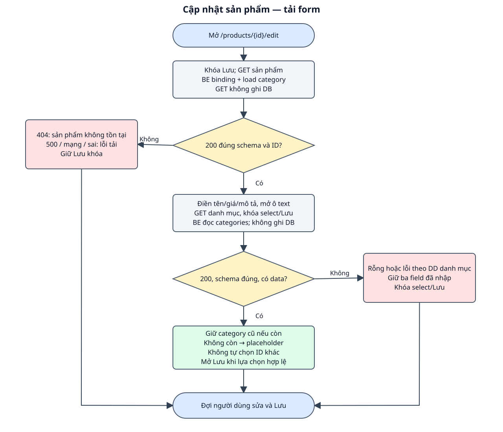
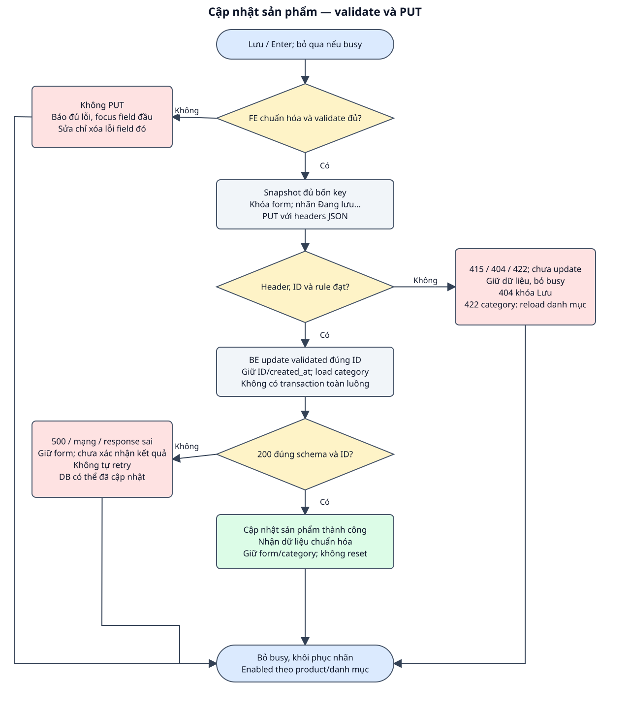

# DD — Cập nhật sản phẩm

## 1. Tổng quan

| Mục | Nội dung |
| --- | --- |
| Phạm vi | Tải sản phẩm và danh mục; sửa tên/giá/danh mục/mô tả; Form gửi PUT đầy đủ bốn field; BE hiện có hỗ trợ cả PUT và PATCH; Không đổi ID/created_at, không thêm autosave hoặc kiểm soát phiên bản. |
| Route / nơi sử dụng | `/products/{id}/edit` — route FE đề xuất, chưa có source. Form dùng PUT đầy đủ; PATCH được đặc tả cho client cập nhật một phần. |
| Quyền | Công khai theo API hiện có; không thiết kế auth/phân quyền. |
| Căn cứ / trạng thái | BE bám source; FE mới là bản nháp chờ review. Không sửa code ứng dụng trong lượt này. |
| Đầu vào | [Raw spec](raw_spec_update_product.md), [BD](bd_update_product.md), [hợp đồng chung](../../shared/api_conventions.md). |
| Bố cục | Form một cột cùng field của form tạo, điền dữ liệu sản phẩm; nút Lưu thay đổi và link về danh sách. |

FE là giao diện trình duyệt; BE là phía máy chủ. Item là thành phần giao diện, Event là thao tác/sự kiện, DS là nguồn dữ liệu, VAL là điều kiện kiểm tra và BR là quy tắc nghiệp vụ. Các mã dùng để đối chiếu testcase, không phải mã lỗi API. Loading là đang tải; schema là cấu trúc và kiểu dữ liệu của response.

## 2. Thành phần giao diện

| Thành phần / Item ID | Loại / mặc định | Hiển thị và tương tác | Nguồn / Event |
| --- | --- | --- | --- |
| INP_NAME/PRICE/DESCRIPTION | Input text / textarea | Giá input text + inputmode decimal; điền giá trị tải; khóa khi chưa có product hoặc đang gửi. | DS_PRODUCT → DS_FORM / EVENT_EDIT |
| SEL_CATEGORY | Select | Load danh mục, chọn category.id của sản phẩm nếu còn trong danh sách; không tự chọn ID khác. | DS_CATEGORIES / EVENT_UPDATE_LOAD |
| BTN_SAVE | Submit | Mở khi product đã tải, danh mục ready và chọn hợp lệ; đang gửi: Đang lưu… | DS_STATE / EVENT_UPDATE_SUBMIT |
| TXT_RESULT/LNK_BACK | Thông báo / link | Lỗi field, kết quả chung; về /products. | DS_STATE |

Nhãn và focus có thể đọc/thao tác bằng bàn phím; thông báo không chỉ thể hiện bằng màu. Dữ liệu API được render như text. Phần UI mới là đề xuất, chưa có hình design để nghiệm thu màu/kích thước.

## 3. Validation

| Field / Validation ID | FE / thời điểm | BE / điều kiện | Thông báo / xử lý |
| --- | --- | --- | --- |
| VAL_NAME | Submit: trim, không rỗng, tối đa 255 ký tự Unicode. | PUT required; PATCH sometimes; string/max:255. | Vui lòng nhập tên sản phẩm / Tên sản phẩm tối đa 255 ký tự. |
| VAL_PRICE | Submit: regex/định dạng theo [DD tạo, mục 3](../create/dd_create_product.md#3-validation), 0..99999999.99, <=2 số lẻ; gửi string. | PUT required; PATCH sometimes; numeric/min/max/decimal:0,2. | Vui lòng nhập giá / Giá phải từ 0 đến 99999999.99 và có tối đa 2 chữ số thập phân. |
| VAL_CATEGORY | ID phải thuộc danh sách đã tải; submit chuyển integer. | PUT required; PATCH sometimes; integer/exists. | Chưa chọn: Vui lòng chọn danh mục. 422: Danh mục không còn hợp lệ, vui lòng chọn lại. |
| VAL_DESCRIPTION | Trim, giữ dòng giữa; trống→null, tối đa 2000 ký tự Unicode. | PUT present/nullable/string/max:2000; PATCH sometimes/nullable/string/max:2000. | Mô tả tối đa 2000 ký tự. |
| VAL_UPDATE_RESPONSE | 200 đúng schema/ID; không công nhận 201 hoặc data thiếu. | Route binding 404; controller update(validated) rồi load(category). | Sai response → chưa xác nhận kết quả; không ghi là thành công. |

## 4. Nguồn dữ liệu

### 4.1. Nguồn và lưu trữ

| Data Source ID | Dữ liệu / nguồn | Đích sử dụng |
| --- | --- | --- |
| DS_PRODUCT | GET chi tiết.data; ID bất biến của route | Điền form và đối chiếu ID response. |
| DS_CATEGORIES | GET danh mục.data[] | Nhận ID/name, giữ danh mục hiện tại nếu hợp lệ. |
| DS_FORM | name/price/category_id/description sau chuẩn hóa | PUT snapshot bốn field; không gửi ID/timestamps. |
| DS_STATE | productReady, categoryStatus, isSubmitting, fieldErrors/result | Control/focus/thông báo; dữ liệu chỉ giữ trong bộ nhớ. |

Schema: [categories/products](../../shared/data_model.md). Giữ trách nhiệm đọc/ghi theo event, không tự thêm bảng hoặc field.

### 4.2. Input/Output

| Thao tác | Input / kiểu / bắt buộc / headers | Output / status / sử dụng FE |
| --- | --- | --- |
| Tải form | GET /api/products/{id} và GET /api/categories; Accept JSON; không body. | 200 Product + 200 category[]; 404/500/mạng/sai schema → trạng thái lỗi. |
| Form lưu PUT | id path bắt buộc; Content-Type/Accept JSON; body đủ name:string, price:string, category_id:integer, description:string\|null. | 200 {data: Product} cập nhật; 415/422/404/500 theo nhánh. |
| Client PATCH | id path; headers JSON; body chỉ field cần sửa, có thể {}. | 200; field không gửi giữ nguyên. PATCH không phải nút/form riêng. |

Schema chi tiết ở các API trong mục 6; [ProductResource và lỗi chung](../../shared/api_conventions.md).

## 5. Xử lý chi tiết sự kiện giao diện

### EVENT_UPDATE_LOAD — tải dữ liệu

**Kích hoạt / điều kiện:** Mở /products/{id}/edit.

1. FE khóa lưu/field chưa có dữ liệu, GET sản phẩm theo ID. BE bind model, load category và trả 200; 404 dừng ở trạng thái not-found.
2. FE kiểm tra schema/ID, điền name/price/description; product đã sẵn sàng thì mở ba ô text. Sau đó GET danh mục, khóa select/lưu khi loading.
3. GET danh mục thành công: giữ category.id cũ nếu có trong danh sách; nếu không thì placeholder và yêu cầu chọn lại. Rỗng hoặc lỗi: giữ ba field, khóa select/lưu, thông báo theo DD danh mục.
4. Không cho gửi trước khi product/category sẵn sàng; tải thất bại không tự ghi DB.

### EVENT_EDIT — sửa trường

**Kích hoạt / điều kiện:** Form không đang gửi và product đã tải.

1. Cập nhật giá trị; xóa lỗi cũ của đúng field và kết quả cũ; chưa validate lại toàn form.
2. Cập nhật enabled nút theo category ready/chọn hợp lệ.

### EVENT_UPDATE_SUBMIT — lưu

**Kích hoạt / điều kiện:** Bấm Lưu thay đổi/Enter input; textarea Enter vẫn xuống dòng.

1. FE bỏ qua khi busy hoặc product/category chưa sẵn sàng. Chuẩn hóa/validate bốn field; báo đủ lỗi và focus field đầu tiên, chưa PUT nếu sai.
2. Hợp lệ: snapshot đủ bốn field, description trống vẫn có key null; khóa form/nút và gửi PUT /api/products/{id} với headers JSON.
3. BE kiểm tra Content-Type JSON (415 khi sai) và bind ID (404 nếu không tồn tại); UpdateProductRequest kiểm tra PUT đầy đủ (422 khi sai); không ghi trước khi qua validation.
4. BE update bằng validated: chỉ thay sản phẩm này, giữ ID/created_at; load category rồi Resource 200. Không có transaction bao trùm update và load.
5. FE 200 đúng schema/ID: báo Cập nhật sản phẩm thành công, cập nhật form theo response chuẩn hóa; không reset hoặc chuyển trang.
6. 422: map key/focus và fallback theo [DD tạo](../create/dd_create_product.md#3-validation); category_id lỗi thì bỏ lựa chọn, GET danh mục lại, giữ tên/giá/mô tả; không tự PUT lại. 404: giữ dữ liệu để đọc, khóa lưu và báo sản phẩm không tồn tại.
7. 415/500/mạng/sai response: giữ dữ liệu, báo lỗi phù hợp; 500/mạng có thể đã cập nhật. Mọi nhánh kết thúc bỏ busy/khôi phục nhãn, enabled theo product/category; không tự retry.

### Workflow

Hình và các event cùng mô tả nhánh success, dữ liệu/validation và lỗi; DB/read-write được ghi trong từng bước.

### Exception Case

| Điều kiện | HTTP / response | FE xử lý | Ảnh hưởng DB |
| --- | --- | --- | --- |
| ID không tồn tại khi tải/lưu | 404, Resource not found. | Sản phẩm không tồn tại; khóa lưu, giữ giá trị đang nhập nếu đã có. | Không ghi bản ghi khác. |
| Dữ liệu sai | Chưa gửi hoặc 422 field errors | Báo đủ lỗi/focus, giữ dữ liệu; category_id lỗi tải lại danh mục. | Không update khi validation lỗi. |
| Sai Content-Type | 415 | Không gửi được dữ liệu cập nhật sản phẩm; giữ form và mở lại control. | Chưa vào controller. |
| GET danh mục/sản phẩm lỗi | 500/mạng/schema sai | Khóa lưu theo phần dữ liệu thiếu; giữ dữ liệu đã tải/nhập. | GET chỉ đọc. |
| Exception trước update thành công | 500 | Chưa xác nhận được kết quả cập nhật sản phẩm; giữ dữ liệu. | Chưa thay dữ liệu nếu lỗi trước ghi. |
| Exception sau update / mạng / response sai | 500 hoặc chưa có response xác nhận | Giữ dữ liệu; không tự gửi lại hoặc khẳng định rollback. | Có thể đã update. |

Danh mục mới có thể mất sau kiểm tra exists nhưng trước UPDATE. Khi đó khóa ngoại chặn ghi và handler trả 500; sản phẩm giữ dữ liệu cũ. API không tự xóa danh mục hoặc đổi sang một danh mục khác.

## 6. Tài liệu API

| API ID | Method / endpoint | Đặc tả |
| --- | --- | --- |
| API_GET_PRODUCT | GET /api/products/{product} | [Tải sản phẩm](../detail/api_specs/api_get_product.md) |
| API_LOAD_CATEGORIES | GET /api/categories | [Danh mục dùng chung](../../categories/list/api_specs/api_load_categories.md) |
| API_PUT_PRODUCT | PUT /api/products/{product} | [PUT đầy đủ](api_specs/api_update_product_put.md) |
| API_PATCH_PRODUCT | PATCH /api/products/{product} | [PATCH một phần](api_specs/api_update_product_patch.md) |

## 7. Business Rules

| Rule ID | Quy tắc | Căn cứ / Event |
| --- | --- | --- |
| BR_UPDATE_ID | Chỉ sửa bản ghi theo ID; giữ ID/created_at, server quản lý updated_at. | ProductController@update / EVENT_UPDATE_SUBMIT |
| BR_UPDATE_FIELDS | PUT đầy đủ bốn key; PATCH bỏ field giữ nguyên; description null xóa mô tả. | UpdateProductRequest / Input/Output |
| BR_UPDATE_VALIDATE | BE validate lại; trùng tên được phép, danh mục phải tồn tại, giá/Unicode theo §3. | Form Request / EVENT_UPDATE_SUBMIT |
| BR_UPDATE_STATE | Chặn gửi lặp, success giữ dữ liệu; lỗi giữ dữ liệu và không retry tự động. | BD đề xuất / EVENT_UPDATE_SUBMIT |
| BR_UPDATE_NO_ROLLBACK_PROMISE | Không có version/transaction toàn luồng; response lỗi không chứng minh update chưa xảy ra. | Controller / Exception Case |

**Điểm cần review:** Đề xuất route edit, dùng PUT cho form và giữ form sau thành công; cần review; Chưa có cơ chế phát hiện hai người cùng sửa; không mô tả chống ghi đè. [Testcase đối chiếu](testcase_update_product.md).

**Chức năng liên quan:** [Validation/form tạo](../create/dd_create_product.md), [chi tiết để tải sản phẩm](../detail/dd_view_product.md), [danh mục](../../categories/list/dd_load_categories.md).
